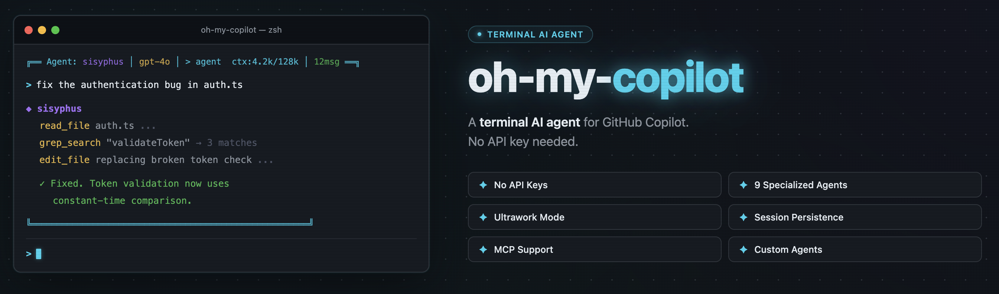
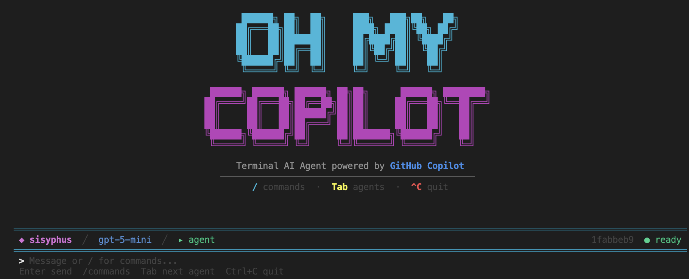

# oh-my-copilot

<sub>Beta. 아직 완전히 안정화된 버전은 아니며, 정식 배포 전까지 일부 동작이 바뀔 수 있습니다.</sub>

[](#)
[](#)
[](#)
[](#라이선스)

GitHub Copilot Chat를 쓸 수는 있지만 별도 모델 API는 쓸 수 없는 팀을 위한 터미널 코딩 에이전트입니다.

`oh-my-copilot`은 Copilot 중심의 터미널 워크플로이며, `oh-my-openagent`에서 영감을 받아 외부 모델 API를 직접 활용할 수 없는 환경을 위해 만들어졌습니다.



[English](../README.md) · [中文](README.zh.md)

## 빠른 시작 🚀

```bash
npm install -g github:JJongyn/oh-my-copilot
omc
```

실행 전에는 VS Code 또는 Cursor가 열려 있고, GitHub Copilot Chat이 활성화되어 있어야 bridge가 시작됩니다.

## 왜 이 프로젝트를 쓰나

- 🧩 Copilot 플랜에 이미 포함된 모델을 그대로 사용
- 🖥️ VS Code 또는 Cursor bridge를 통해 로컬에서 동작
- 🤖 자율 실행, background agent, hooks, sessions, `/init` 지원
- 🛠️ Markdown 기반 Copilot 스타일 custom agent와 optional skill 로드 가능
- 🔌 MCP 서버와 Copilot editor tool을 함께 노출

## 이런 팀에 맞습니다

- 이미 GitHub Copilot Chat를 쓰는 팀
- 회사 정책상 직접 모델 API를 붙일 수 없는 환경
- 브라우저 대신 터미널 중심 워크플로를 원하는 개발자

## 처음 해볼 것 👇

```bash
omc doctor --verbose
omc
```

TUI 안에서는 아래 순서로 시작하는 게 가장 쉽습니다.

- `/init`: 현재 저장소를 분석하고 `.omc/project-context.md` 생성
- `/harness`: 프로젝트 전용 team을 생성하고 harness mode로 전환
- `/harness regenerate`: 기존 generated harness를 지우고 현재 모델 기준으로 다시 생성
- `/skills`: 현재 세션에서 쓸 skill 활성화
- `/agent basic`: 기본 Copilot 느낌으로 사용
- `/agent sisyphus`: 자율 실행 에이전트 사용
- `/mcp`: 연결된 MCP 서버와 Copilot editor tool 확인
- `/background`: background sub-agent 상태 확인



## TUI 명령어 안내

대부분의 사용자는 CLI 명령을 많이 치기보다, `omc`로 들어간 뒤 TUI 안에서 작업하게 됩니다.

| TUI 안 명령어 | 설명 |
| --- | --- |
| `/init` | 현재 저장소를 분석하고 `.omc/project-context.md` 생성 |
| `/harness` | 프로젝트 전용 harness team을 생성 또는 갱신하고, skill을 활성화한 뒤 harness mode로 진입 |
| `/harness regenerate` | 기존 generated harness 산출물을 지우고 현재 모델로 다시 생성 |
| `/skills` | bundled, project, global skill을 보고 현재 세션에서 토글 |
| `/agent <name>` | 내장 또는 custom agent로 전환 |
| `/mode <name>` | `ask`, `plan`, `agent`, `ultrawork`, `harness` 모드 전환 |
| `/mcp` | 현재 보이는 MCP 서버와 Copilot editor tool 확인 |
| `/background` | 실행 중이거나 완료된 background sub-agent 확인 |
| `/new` | 새 대화 세션 시작 |
| `/sessions` | 저장된 세션 다시 열기 또는 확인 |
| `/help` | 키보드 및 사용법 도움말 표시 |

## CLI 명령어

| 명령어 | 설명 |
| --- | --- |
| `omc` | 대화형 터미널 UI 시작 |
| `omc chat` | 대화형 터미널 UI를 명시적으로 시작 |
| `omc run "<작업>"` | TUI 없이 자율 작업 실행 |
| `omc init` | 현재 저장소를 분석하고 로컬 프로젝트 컨텍스트 생성 |
| `omc harness --generate` | 프로젝트 전용 harness team 생성 또는 갱신 |
| `omc skills` | 사용 가능한 skill 목록과 pinned skill 관리 |
| `omc doctor --verbose` | bridge 상태, 모델, 도구, MCP 탐색 상태 확인 |
| `npm run verify` | 내부 배포 전 주요 검증 실행 |

## 에이전트와 모드

주요 에이전트:

- `basic`: 최소 개입형 Copilot 스타일 assistant
- `sisyphus`: 기본 실행 에이전트
- `hephaestus`: 더 깊게 구현하는 worker
- `prometheus`: planner
- `atlas`: 오케스트레이션 중심 agent

주요 모드:

- `ask`: 바로 답변
- `plan`: 읽기 전용 계획
- `agent`: 자율 실행
- `ultrawork`: 탐색, 계획, 위임, 구현, 리뷰, Oracle 검증까지 강하게 거치는 superpowers 스타일 실행 모드
- `harness`: 생성된 project team과 skill을 우선 활용하는 모드

## Harness Mode

Harness mode는 현재 프로젝트를 generated team workflow로 바꿉니다.

- `/harness`는 현재 Copilot 모델을 사용해 프로젝트를 분석하고 팀 초안을 설계
- `/harness regenerate`는 기존 generated harness 산출물을 지우고 처음부터 다시 생성
- 그 결과를 바탕으로 `.github/agents/` 아래 프로젝트 전용 agent를 생성
- 동시에 `.omc/skills/` 아래 프로젝트 전용 skill을 생성
- 현재 세션은 그 skill을 자동 활성화하고 `harness` mode로 전환
- 실제 runtime executor는 `sisyphus`나 `atlas` 같은 built-in agent를 유지하지만, delegation은 generated team을 우선 사용
- 모델 기반 설계가 실패하면 deterministic fallback harness를 만들고, TUI에 경고를 표시

## Custom Agent

프로젝트 수준 custom agent:

```text
.github/agents/*.md
```

전역 custom agent:

```text
~/.oh-my-copilot/agents/*.md
```

Copilot 스타일 frontmatter의 `model`, `tools`, `target`, `mcp-servers`를 지원합니다.

## Skills

Skill은 현재 agent 위에 선택적으로 얹는 prompt bundle입니다.

프로젝트 skill:

```text
.omc/skills/<name>/SKILL.md
```

개인 전역 skill:

```text
~/.oh-my-copilot/skills/<name>/SKILL.md
```

주요 사용법:

- `/skills`: picker에서 현재 세션 skill 토글
- `/skill enable <name>`: 지금 세션에서만 활성화
- `/skill pin <name>`: 이 프로젝트 기본 활성화
- `omc skills --global-pin <name>`: 모든 프로젝트 기본 활성화

기본으로 `stich-*` skill들이 포함되어 있어서 Stitch 스타일 UI 작업 흐름에 바로 쓸 수 있습니다.

## Ultrawork

`ultrawork`는 가장 강한 실행 모드입니다.

- 느슨한 자율 실행이 아니라 superpowers 스타일 workflow를 따릅니다
- 코드 수정 전에 충분한 탐색을 요구합니다
- 적절할 때 focused subtask를 background agent나 specialist agent로 위임하도록 유도합니다
- 완료 전에는 검증과 수정 파일 재확인을 요구합니다
- 마지막에는 Oracle이 다시 한 번 검증합니다

## MCP 와 Copilot Tool

`oh-my-copilot`은 workspace 설정, editor 사용자 설정, `~/.oh-my-copilot/mcp.json`을 읽어 MCP 서버를 찾습니다. 동시에 bridge를 통해 `vscode.lm.tools`에 보이는 Copilot editor tool도 노출합니다.

현재 사용 가능한 항목은 `/mcp`에서 바로 확인할 수 있습니다.

## 내부 배포 전 확인

```bash
npm run verify
npm run package:bridge
omc doctor --verbose
```

## 저장소 구조

```text
src/      CLI, TUI, agents, runtime, tools, sessions
bridge/   로컬 bridge를 제공하는 VS Code extension
scripts/  설치 및 패키징 스크립트
docs/     번역 문서와 릴리스 문서
```

## 참고

- 이 프로젝트는 의도적으로 Copilot 전용입니다.
- 터미널별 IME 동작 차이는 일부 남을 수 있습니다.

## 참고한 프로젝트

이 프로젝트는 `opencode`, `oh-my-openagent`, `superpowers`의 아이디어와 워크플로를 참고해 만들었습니다.

## 라이선스

MIT
